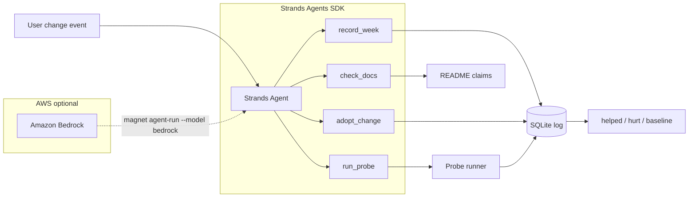

# DEVPOST-READY · MAGNET · Agents for Humans

**Event:** [Agents for Humans](https://agentsforhumans.devpost.com/) · deadline **Sep 14 2026 5pm PDT** · $40K  
**Track:** Professional Agents  
**Repo:** https://github.com/Morkeeth/agents-for-humans · MIT

> Companion product (not this submission): [Agent Grinder](https://agentgrinder.vercel.app) — social layer for posting real agent runs.

---

## Tagline (≤60 chars)

**Know if your agent change helped — or baseline**

(48 chars)

---

## One-liner + constraint

**One-liner:** After you change a prompt, model, or skill, MAGNET's Strands agent re-runs **your** eval and prints `helped`, `hurt`, or **`baseline`** — never a trend from one reading.

**Constraint:** No number without the command, population, and timestamp (`3/5`, never `3`).

---

## Problem · who · why (video pitch seed)

**Problem:** Developers adopt agent skills, prompts, and models constantly — but nobody remembers what actually worked. Naive tools say `helped` after a single reading.

**Who:** Professional developers running agentic coding stacks (Claude, Cursor, custom Strands agents).

**Why it matters:** Without a measured adoption log, every "improvement" is vibes. MAGNET is the eval runner + receipt printer for **your** stack.

---

## What to demonstrate (video, 2 to 3 min)

One workflow, nothing else on screen: change a prompt, MAGNET re-runs your eval, reads `hurt` then `helped`. Six commands, 21 s of wall clock on main @ f690fd0 (2026-09-03): `112/112 → 111/112 hurt → 112/112 helped`. Then `magnet agent-run` for the Strands loop.

Shot list with timestamps, commands and say-lines: `docs/VIDEO-SHOTLIST.md`. Commands and pasted output: `docs/DEMO-ONE-WORKFLOW.md`. Do not show `magnet demo` in the video (it uses a labelled simulated week).

## Architecture



Full diagram: `docs/architecture.md`

**AWS note:** Default `magnet agent-run` uses a **local scripted Strands model** (no spend, CI-safe). Live Bedrock path documented for judges with AWS creds: `magnet agent-run --model bedrock`.

---

## Strands proof

```bash
magnet agent-run
# MODE: strands agent loop · local scripted model
# tools dispatched: run_probe → record_week → adopt_change → record_week → check_docs
```

119 pytest tests · `bash scripts/stranger-pass.sh` → exit 0

---

## Screenshots (capture for Devpost)

| # | Command | What to capture |
|---|---------|-----------------|
| 1 | `magnet demo` | naive `helped` vs magnet `baseline` on 1 reading |
| 2 | `magnet eval` | silent_null vs naive vs magnet table |
| 3 | `magnet agent-run` | Strands tool dispatch + receipt |

---

## What we are NOT

- Skill marketplace
- Helicon-only dependency (in-repo SQLite at `.magnet/log.db`)
- Fabricated trends or invented metrics
- Auto-posting social feed (that's Agent Grinder, separate product)

---

## Bonus · builder.aws

Draft post: `docs/BUILDER-AWS-DRAFT.md` — publish before deadline with #AgentsForHumans

---

## Oscar gates (not cloud)

- [ ] AWS Builder ID on Devpost
- [ ] Record ≤5 min video
- [ ] Optional: `magnet agent-run --model bedrock` with real AWS creds
- [ ] Submit Devpost before Sep 14 5pm PDT

See `docs/OSCAR-CLICK-LIST-2026-09-02.md`
