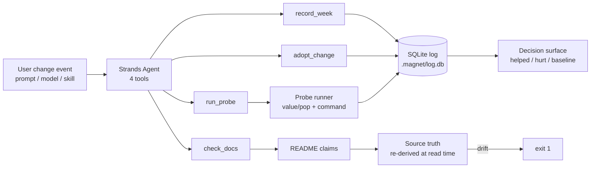
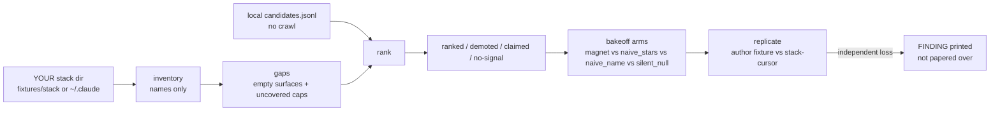
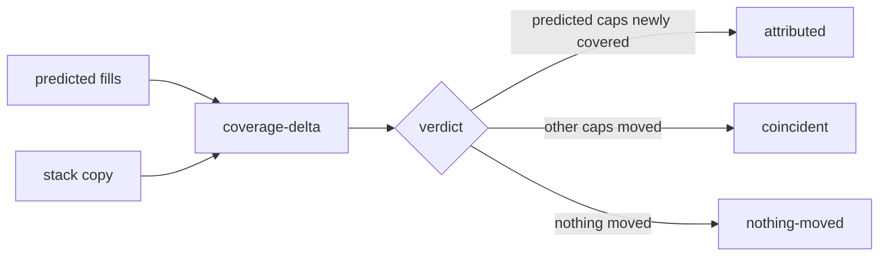
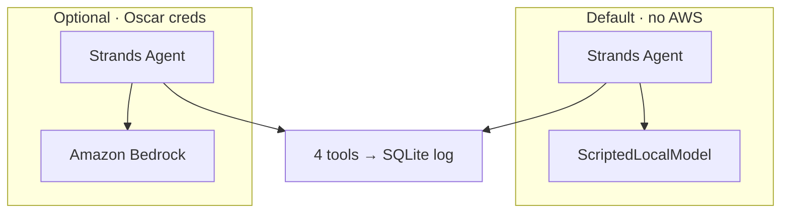

# Architecture

MAGNET wires a **Strands agent** to an **in-repo SQLite adoption log** and **deterministic probes**.
After you change a prompt, model, or skill, the agent re-runs your eval and prints
`helped`, `hurt`, or **`baseline`** — never a trend from one reading.

A second surface inventories **YOUR** agent stack and ranks a local candidates file
against YOUR gaps — not a marketplace crawl. Science ported from
`helicon/magnet.py` (mountain-of-helicon).

## Data flow

1. **Baseline** — `record_week` runs `run_probe`, stores `{value, population, command, week}`.
2. **Change** — `adopt_change` records `{change_type, description, prediction}` linked to a probe.
3. **Re-run** — next `record_week` stores a second reading.
4. **Receipt** — reporter compares two *measured* readings:
   - `<2 readings` → **`baseline`**
   - delta matches direction → **`helped`** (↑)
   - delta opposes direction → **`hurt`** (↓)

## Components

| Module | Role |
|--------|------|
| `magnet/tools.py` | Strands `@tool` wrappers |
| `magnet/log.py` | SQLite schema + round-trip |
| `magnet/reporter.py` | value/pop, baseline, helped/hurt (ported from measurement-bench science) |
| `magnet/probes.py` | `demo-pass-rate`, `check-docs`, **`pytest-pass-rate`** (real eval) |
| `magnet/registry.py` | Load YOUR probes from `.magnet/probes.json` |
| `magnet/history.py` | Adoption timeline / decision surface |
| `magnet/demo.py` | One-command cold demo |
| `magnet/stack.py` | Inventory + gaps + fit ranking (ported from helicon.magnet) |
| `magnet/bakeoff.py` | magnet vs naive_stars vs naive_name vs silent_null |
| `magnet/replicate.py` | Author fixture vs independent Cursor stack bakeoff |
| `magnet/coverage_delta.py` | Prediction vs coverage before/after temp install |

## Naive baseline arm

`reporter.naive_verdict()` always returns `helped` on fewer than two readings — the two-hour team bug MAGNET exists to catch. The demo prints both verdicts side by side.

`magnet bakeoff` adds marketplace proxies: **naive_stars** (rank by star count) and **naive_name** (alphabetical tie-break of zero-score items — the EXP-MAGNET-01 defect).

`magnet replicate` re-runs that bakeoff on **`fixtures/stack-cursor`** (live Cursor skills, not designed by the filter author). If magnet loses there, the receipt says LOST — that finding is the product.

## AWS path (optional · Oscar click)

| Mode | Command | AWS services | Cost |
|------|---------|--------------|------|
| **Local scripted** *(default, CI)* | `magnet agent-run --model local` | none | $0 |
| **Bedrock** *(live LLM chooses tools)* | `magnet agent-run --model bedrock` | Amazon Bedrock | yes |
| **Deterministic fallback** | `magnet agent-run --model none` | none | $0 |

The Strands agent loop is identical in all modes — only the model provider changes. Bedrock has **never** been run in CI; document honestly on Devpost if only local mode is demonstrated in the video.

